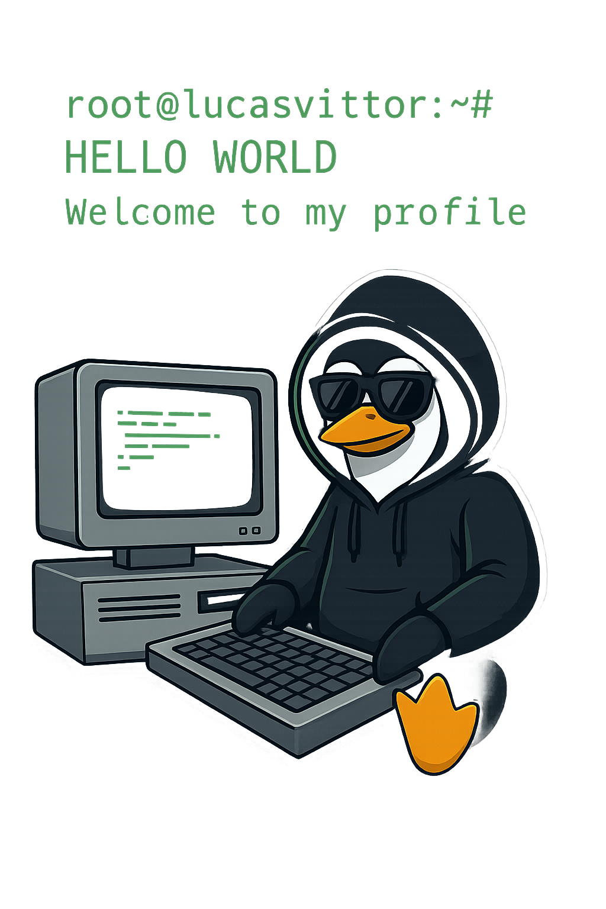

# Sobre Mim

Amante Da **EUCARISTIA** e da **TECNOLOGIA**, estou em transição para a área da **Segurança da Informação** com foco em Purple Team, explorar vulnerabilidades, criar automações e brincar com infraestrutura.
- 🎓 Graduado em Análise e Desenvolvimento de Sistemas
- 📚 Pós-graduando em Segurança Cibernética
- 🛠️ Experiência em resolução de problemas, redes e automações
- 🧠 No tempo livre? Programo alguma ideia aleatória, ou corro pro fut... Talvez um Fifa
- 🎮 Viciado em Hacknet! Quem diria que hackear (no jogo!) seria tão divertido?

  
  

# Tecnologias e Ferramentas

  
  
  
  
  
  
  
  
  
  
  

# Contribuições

<picture>
  <source media="(prefers-color-scheme: dark)" srcset="https://raw.githubusercontent.com/lucasvittor/lucasvittor/output/pacman-contribution-graph-dark.svg">
  
</picture>
